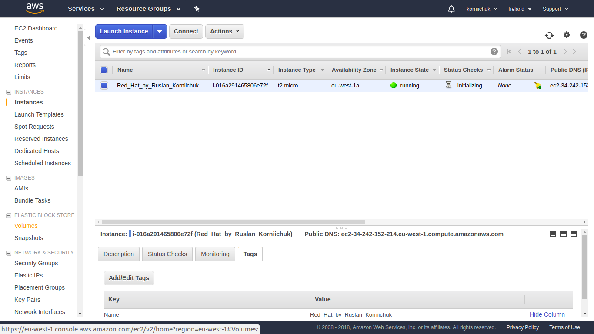
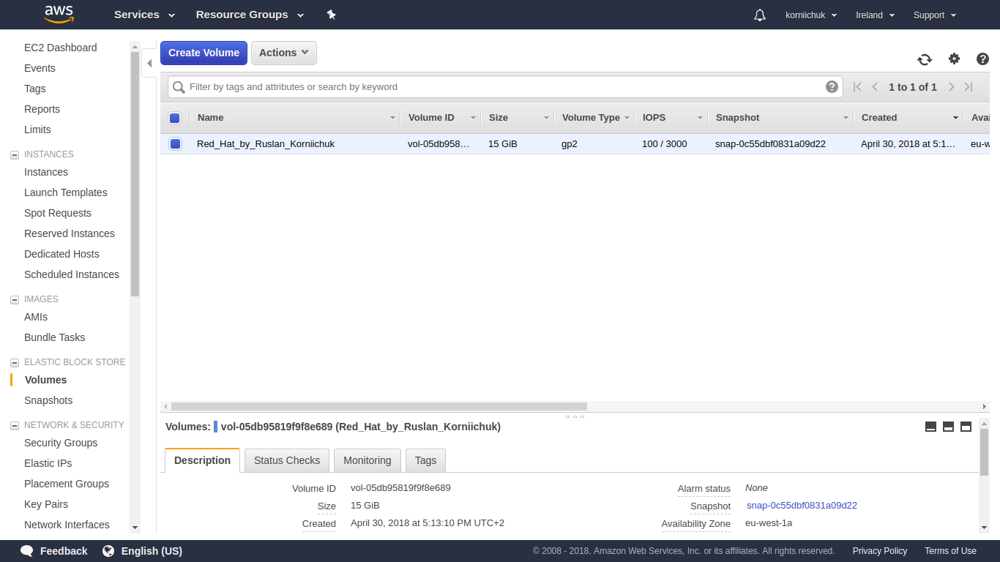
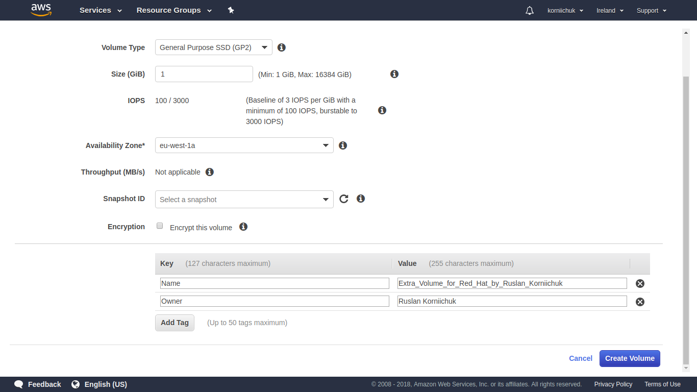
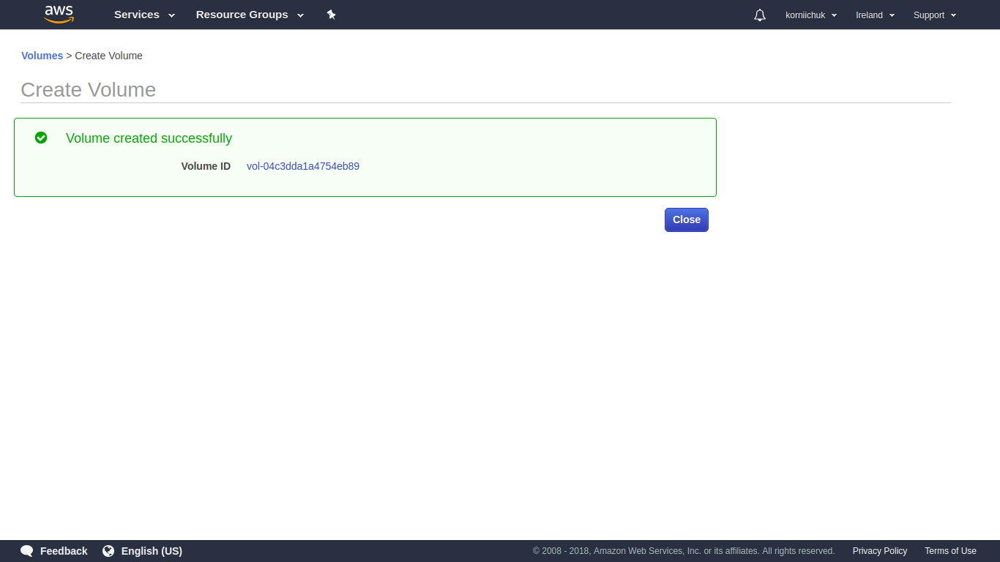
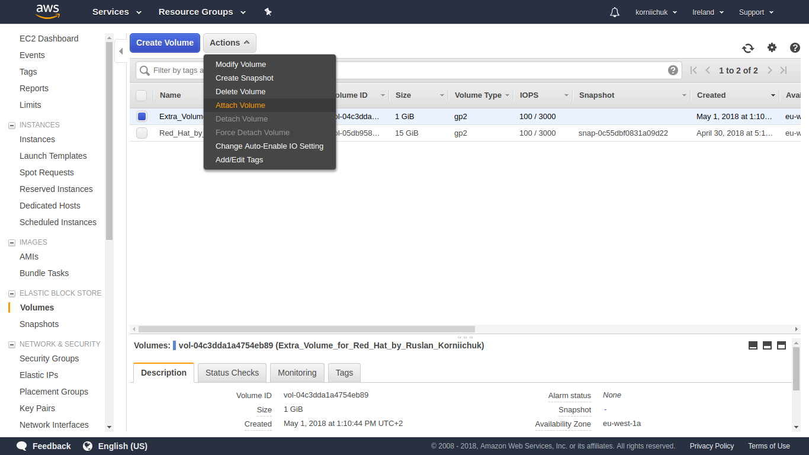
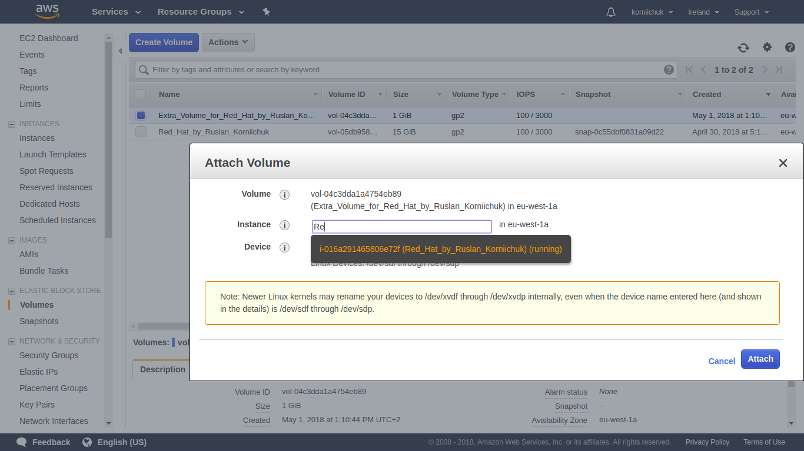
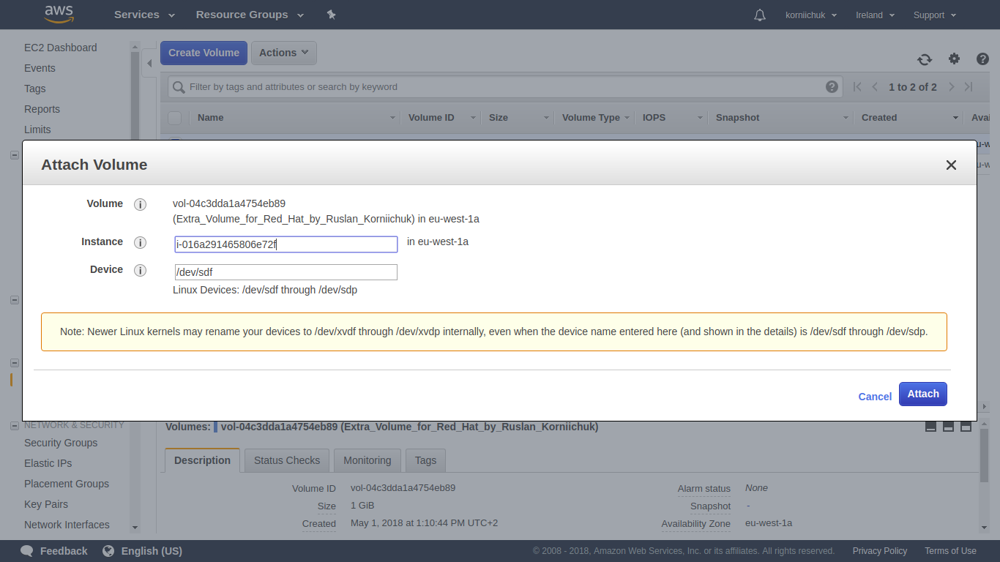

# Configure Linux Red Hat 7 LVM via Ansible

## Table of Contents
**[Short Description](#short-description)**

**[Full Description](#full-description)**

**[Creat Volume for VM via AWS](#creat-volume-for-vm-via-aws)**

## Short Description
Ansible LVM

## Full Description
LVM configuration using Ansible 2.4/2.5 in Red Hat Enterprise Linux (RHEL) 7.4/7.5.

## Creat Volume for VM via AWS
You can create an Amazon EBS volume that you can then attach to any EC2 instance within the same Availability Zone.
### Create Volume
1st, open [Amazon EC2 console](https://console.aws.amazon.com/ec2/).

2nd, from the navigation bar, select the region in which you would like to create your volume. In the navigation pane, choose `ELASTIC BLOCK STORE`, `Volumes`. See images below:

3rd, choose `Create Volume`. See images below:

4th, for `Volume Type`, choose a volume type. For `Size (GiB)`, type the size of the volume. For `Availability Zone`, choose the Availability Zone in which to create the volume. EBS volumes can only be attached to EC2 instances within the same Availability Zone. Choose `Create Volume`. See images below:

5th, choose `Close`. See images below:

### Attach Volume
1st, open [Amazon EC2 console](https://console.aws.amazon.com/ec2/).

2nd, in the navigation pane, choose `Elastic Block Store`, `Volumes`. Select an available volume and choose `Actions`, `Attach Volume`. See images below:

3rd, for `Instance`, start typing the name or ID of the instance. Select the instance from the list of options (only instances that are in the same Availability Zone as the volume are displayed). See images below:

4th, for `Device`, you can keep the suggested device name. Choose `Attach`. See images below:

